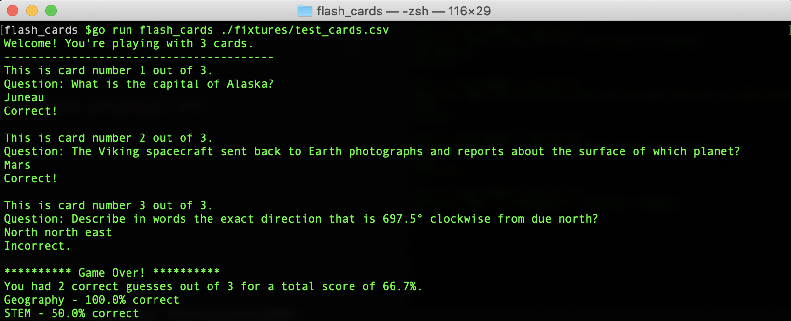

# Flash Cards

Flash Cards is a command line application I built to practice Go development and testing skills. The program simulates a set of flash cards, allowing users to view questions, make guesses, and see a final score at the end of the round via the command line.
  

## Local Setup
To run the project in your local environment, follow the instructions below:

  1. Clone the repository: 
    `git clone git@github.com:cunninghamge/flash_cards_go.git` 
    `cd flash_cards_go`
  2. Install Go with 
    `brew install go`
  3. To run tests: 
    `go test ./...` 
    or, to run tests with a detailed coverage report, run: 
    `go test ./... -v -coverprofile cover.out` 
    `go tool cover -html=cover.out` 

## Game Play
Launch the flash card runner in the command line by running  `go run flash_cards`

You can run the program with your own set of flash cards using a CSV file. The file should not have headers, and each line should have three fields: a question, an answer, and a category. See `./fixtures/default_cards.csv` for an example (these are the default cards for playing the game). To play with a custom set of cards, pass the location of your CSV file as an argument when launching the game, e.g. `go run flash_cards ./fixtures/test_cards.csv`